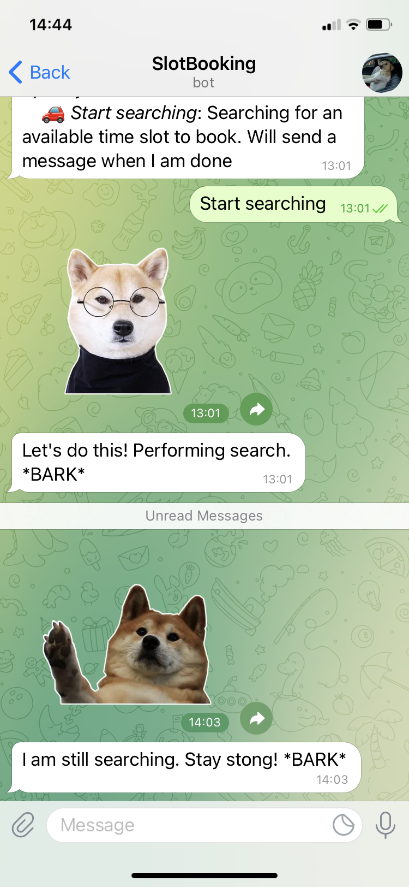
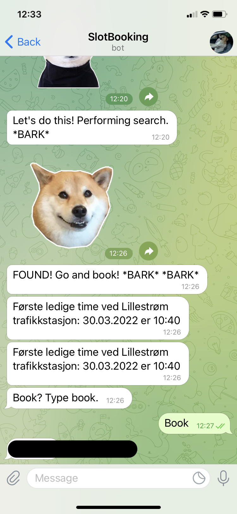

# Exam-booking-BOT-for-Statens-Vegvesen-
A script that monitors the first available examination date and sends it to Telegram  as notification.

## Background
Statens vegvesen is a norwegian institution that is responsible for roads, vehicle regulations and driver licencing. The latter will be the main focus of this project.
To obtain a driver licence, one must go thorough numerous mandatory driving hours, theory, and, of course, practical driving test. This final test (or exam if you wish) one must book via Statens Vegvesen's web page which unfortunately does not always offer that many spots available. In most of the times, there are no available dates to book and the only way to get an empty spot is to simply wait until someone else cancels his/her appointment so you can jump in.

The main advice from teachers in traffic schools is to refresh the Statens Vegvesen's examination page around 1000 time per day, and jump in to the time slot when available.  

🛠 **Problem**: lack of time to check when the available spot in the calender pops up;

💡 **Solution**: automate the checking routine and notify when the available spot appears!

## How is works

1. You execute the code on your laptop.
2. Start the bot in Telegram. The name is "SlotBookingBot"
3. Type "Start searching"
4. A new page in Google chrome browser will appear with Statens Vegvesens web page. You have 80 seconds to authorize and find a driving school you want to find a place in.
5. Wait till the bot finds a first available date.
6. Type "Book" to reserve a found time slot. 

<p align="center">


  </p>
<figcaption align = "center"> 
  <b>Fig.2 Application's interface.</b>
</figcaption>

## Code

Code's sections:
- connect to the webpage (autorization)
- web page scanning
- refresh and notification modules
- scrape the data when found
- book

Bot is activated by executing */start* command, which greets the user and introduces the important parameters. The listed parameters are "Refresh frequency", "Runtime", "Book" and "Start searching". The first two variables allow user to set how often one wants to refresh the page before its contents would be scraped, the default value is 25 seconds, meaning the the page would be refreshed every 25 secons. This value is not random - because of the dynamic nature of the web page that we are scraping (Statens Vegvesen) its elements are not uploaded immidiately when the page has been refreshed. It was found that the page´s contents are fully loaded after 10-15 seconds, so to be on the safe side one should choose refresh frequency somewhere between 15 and 25 seconds. *Runtime* - tells how long the scraping should be running. The default values is 2 hours. 

```Python
@bot.message_handler(commands=["start"])
def welcome(message):
    sti = open('/Users/vladimirlevchenko/DokumenterHD/programming/telegram_bot/static/welcome.webp', 'rb')
    bot.send_sticker(message.chat.id, sti)
    str = """Welcome, {0.first_name}!\n *BARK* \n <b>{1.first_name}</b> is here to book a time slot for you at Statens Vegvesen.\n
    Please type in one-by-one the following commands:
    🏁 <i>Refresh frequency</i>: how frequent to check the available time. Type in a number which corresponds to seconds. Default is 25 seconds.
    🕐 <i>Runtime</i>: How long do I have to check if the time slot is available. Specify number of hours (Default value is 2 hours).
    📚 <i>Book</i>: To book to the first available time slot.
    🚗 <i>Start searching</i>: Searching for an available time slot to book. Will send a message when I am done"""
    bot.send_message(message.chat.id, str.format(message.from_user, bot.get_me()),
    parse_mode="html")
```

Challenges:
- authorization. Was overcame by setting a waiting time on ca 80 seconds - enough to login manually and choose the traffic school. When time is up, script recconects to the opened web page and continues to execute:

```Python
def time_slot_check_Connection():
    driver = webdriver.Chrome(
                executable_path = "/Users/vladimirlevchenko/DokumenterHD/programming/telegram_bot/chromedriver_2"
                )
    url = "https://www.vegvesen.no/dinside/?goto=https%3A%2F%2Fwww.vegvesen.no%2Fdinside%2Fdittforerkort%2Ftimebestilling%2F"

    response = driver.get(url)
    time.sleep(80) # waits till done logining

    # Reconnect to the opened web page
    new_html_source = driver.page_source
    return driver, new_html_source
```
- Refresh. ALthough it is tempting to refresh the page as often as possible, the refresh page too frequent would result in not fully reloaded content of the page. That would lead to not properly scraped page, or more presice - not scraped at all because the content had not loaded. 

```Python
def func_refresh_frequency(message):
    global refresh_seconds
    try:
        refresh_seconds = float(message.text)
        bot.send_message(message.chat.id, "Got it, *BARK*")
    except Exception:
        bot.send_message(message.chat.id, "It's not a number. Try again, *BARK*")
```

- Results check
The "heart" of the bot is a scraping section. This is where the webpage is checked whether any dates are available.

```Python
def search_check(message, results):
    global running
    global refreshed_html
    global available_days
    global notif
    global soup

    count = 0
    # Reconnects to the open page in browser
    refreshed_html = results[0].page_source

    if "ingen ledige timer" in refreshed_html:
        count = count + 1
        print(count)
    if "Velg dato" in refreshed_html:
        sti_4 = open('/Users/vladimirlevchenko/DokumenterHD/programming/telegram_bot/static/found.webp', 'rb')
        bot.send_sticker(message.chat.id, sti_4)
        bot.send_message(message.chat.id, "FOUND! Go and book! *BARK* *BARK*")

        soup = BeautifulSoup(refreshed_html, 'html.parser')

        # This part returns the first available time slot to book
        rows = iter(soup.find_all("main", {"id": "hovedinnhold"}))
        for row in rows:
            a = row.find("div", class_="radiosjekk-kolonne")
            first_available_slot = a.find("div", class_="bottom-spacing-medium").text
            print(first_available_slot)

        bot.send_message(message.chat.id, first_available_slot)
        bot.send_message(message.chat.id, "Book? Type book.")

        # Turns of the jobs in the queue (stops the while loop)
        running = False

        # This part collects the available dates and saves them in a list
        available_days = []
        rows = soup.find_all("td", class_= "elm-kalender-dag elm-kalender-dag-velgbar")
        for row in rows:
            available_days.append(row.text)

        bot.send_message(message.chat.id, "Also the following dates are available:")
        scraped_days = scrape_all_dates()
        for y in scraped_days:
            bot.send_message(message.chat.id, f"Date: {y}{first_available_slot[-17:-9]}\nTime:{scraped_days[y]}")
```

- Book
